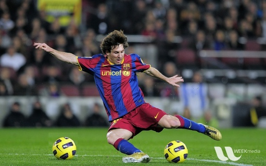
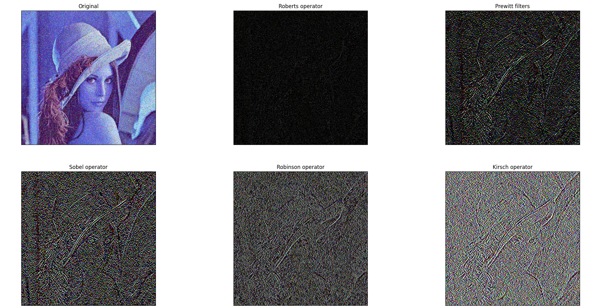
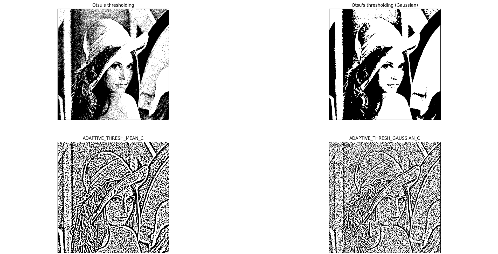
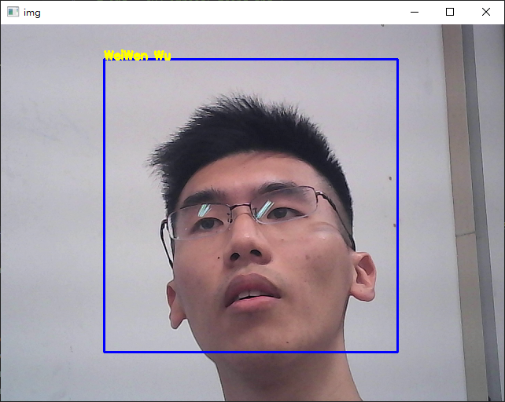

Computer vision
===============
Copyright © 2023 WeiWen Wu

HW1
---
Execute [`video_in_out.py`](./HW1/video_in_out.py)

HW2
---
修改 [`mouse_event_draw_lines.py`](./HW2/mouse_event_draw_lines..py) 使得可以畫不連續線段圖

[](./HW2/HW2.jpg)

HW3
---
利用get_pixel_coordinates.py 先找到Messi的頭部區域範圍，修改basic_operations_on_images.py，使得畫面中出現雙頭的Messi在踢球並有浮水印。

[](./Messi_play_with_2_balls.jpg)

HW4
---
Gray level thresholds for Lena.

[](./HW4/result.png)

Source code: [lena_adjust_trackerbar.py](./HW4/lena_adjust_trackerbar.py)

HW5
---
Please refer to handout of Image Filtering Using Convolution in OpenCV
請參考在OpenCV中使用卷積進行圖像過濾的講義

1. First apply Gaussian Smoothing mask to blur the lena_noise.jpg, followed by applying Roberts operators: Px first, then Py. Print the after processed image.
(首先應用高斯平滑蒙版使lena_noise.jpg模糊，然後應用羅伯茨運算符：首先是Px，然後是Py。列印處理后的圖像。)

2.  First apply Gaussian Smoothing mask to blur the lena_noise.jpg, followed by applying Prewitt filters: Px first, then Py. Print the after processed image.
(首先應用高斯平滑蒙版來模糊lena_noise.jpg，然後應用 Prewitt 濾鏡：首先是 Px，然後是 Py。列印處理后的圖像。)

3. First apply Gaussian Smoothing mask to blur the lena_noise.jpg, followed by applying Sobel operator: Px first, then Py. Print the after processed image.
(首先應用高斯平滑蒙版模糊lena_noise.jpg，然後應用Sobel運算符：Px，然後是Py。列印處理后的圖像。)

4. First apply Gaussian Smoothing mask to blur the lena_noise.jpg, followed by applying Robinson operator: Px first, then Py. Print the after processed image.
(首先應用高斯平滑蒙版模糊lena_noise.jpg，然後應用羅賓遜運算符：首先是 Px，然後是 Py。列印處理后的圖像。)

5. First apply Gaussian Smoothing mask to blur the lena_noise.jpg, followed by applying Kirsch operator: Px first, then Py. Print the after processed image.
(首先應用高斯平滑蒙版來模糊lena_noise.jpg，然後應用 Kirsch 運算符：Px，然後應用 Py。列印處理后的圖像。)

6. Apply the above five sets of operator to lena.jpg and explain the major functions of every set of operators. 
(將以上五組算子應用到lena上.jpg並講解每組算子的主要功能。)

[](./HW5/Figure_1.png)

HW6
---
Referring to blur_filters.py 

1. Apply the following filters to lena_noise2.jpg and lena_noise3.jpg 
    ```c++
    cv.filter2D()
    cv.blur()
    cv.GaussianBlur()
    cv.medianBlur()
    cv.bilateralFilter()
    ```

2. Pick up two  of above filters. Sequentially apply them to filter lena_noise3.jpg to see if better result can be obtained.

* [lena_noise2.jpg](./lena_noise2.jpg)
[](./HW6/lena_noise2.png)

* [lena_noise3.jpg](./lena_noise3.jpg)
[](./HW6/lena_noise3.png)

HW7
---
用下列4個門檻值設定的方法,找出門檻值,將

lena_noise2.jpg
處理後的四個影像及程式放在WORD檔後上傳
cv.threshold 

cv.adaptiveThreshold,包含使用cv.ADAPTIVE_THRESH_MEAN_C與cv.ADAPTIVE_THRESH_GAUSSIAN_C的結果

```python
# Otsu's thresholding
ret2,th2 = cv.threshold(img,0,255,cv.THRESH_BINARY+cv.THRESH_OTSU)
```

[](./HW7/Figure_1.png)

HW8
---
1. Refer to and modify canny_edge.py source code, write a small application to find the Canny edge detection whose threshold values can be varied using two trackbars. This way, you can understand the effect of threshold values. 
(參考並修改canny_edge.py原始程式碼，編寫一個小應用程式來查找Canny邊緣檢測，其閾值可以使用兩個跟蹤條來改變。這樣，您可以瞭解閾值的影響。)

2. Take turns to use lena.jpg, lena_noise.jpg, lena_noise2.jpg and lena_noise3.jpg  as image input files for edge detection. You need to apply Gaussian Blur and Median Blurring on gray level images to reduce the noise before perform the edge detection.
(輪流使用lena.jpg、lena_noise.jpg、lena_noise2.jpg和lena_noise3.jpg作為圖像輸入檔進行邊緣檢測。在執行邊緣檢測之前，您需要對灰度圖像應用高斯模糊和中值模糊以減少噪點。)

3. use cv2.imwrite to save the edge detection result similar to the attached file.
(使用 cv2.imwrite 保存類似於附件的邊緣檢測結果。)

4. Put the print screen of the window displaying your the edge detection result and python source code in a Word file. Submit that word file to this link. 
(將顯示邊緣檢測結果和python原始程式碼的視窗的列印螢幕放在Word檔中。將該 word 檔提交到此連結。)

[](./HW8/Canny.png)

HW 9
---
1. Adjusting the training stage number (12-18) when you are running CascadeTrainerGUI_3.3.1_x64 to create a cascade classifier file of cascade.xml that can detect your own face.
(跑步時調整訓練階段數（12-18） CascadeTrainerGUI_3.3.1_x64創建級聯的級聯分類器檔.xml可以檢測您自己的人臉。)

2. Modify object_detection.py and adjust the last two numerical parameters of `object_cascade.detectMultiScale(gray, 1.3, 5)` so that your own face can be better detected and your name will be displayed when your face is detected.
(修改object_detection.py並調整最後兩個數值參數。這樣你自己的臉就可以被更好地檢測出來，當你的臉被檢測到時，你的名字就會被顯示出來。)

3. Hand in a word file contains your Python Source code and print-screen of your detected  face.  
(提交一個word檔，其中包含您的Python原始程式碼和檢測到的人臉的列印螢幕。)

[](./HW9/result.png)

HW 10
-----
0. Check the available feature classifiers at 
(檢查可用的要素分類器)
    ```
    C:/opencv/sources/data/haarcascades
    C:/opencv/sources/data/haarcascades_cuda
    C:/opencv/sources/data/hogcascades
    C:/opencv/sources/data/lbpcascades
    ```

1.  Write a Python program to test the haarcascade_smile.xml classifier. Include print screen and Python code.
(編寫一個 Python 程式來測試 haarcascade_smile.xml 分類器。包括列印螢幕和 Python 代碼。)

2.  Download and unzip "Zipped Haar cascade classifier xml files". Write a Python program to test as many xml classifiers related to human as possible at the same time. Include print screen and Python code.
(下載並解壓縮「壓縮的哈爾級聯分類器 xml 檔」。編寫一個 Python 程式來同時測試盡可能多的與人類相關的 xml 分類器。包括列印螢幕和 Python 代碼。)

[](./HW10/HW10.jpg)

HW 11
-----
The question is given on page 21 of [Object detection with integral image based extended set of Haar-like features and Adaboost algorithm.pptx](./HW11/Object%20detection%20with%20integral%20image%20based%20extended%20set%20of%20Haar-like%20features%20and%20Adaboost%20algorithm.pptx)
(該問題在第 21 頁給出使用基於集成圖像的擴展類 Haar 特徵集和 Adaboost 演演算法進行物件檢測 .pptx)

```python
from utils import Classifier
### Define x value and y value. ###
## Example
X_EX:list = [0,1,2,3,4,5,6,7,8,9]
Y_EX:list = [1,1,1,-1,-1,-1,1,1,1,-1]
## Homework
X_HW:list = [1, 3, 9,11]
Y_HW:list = [1,-1, 1,-1]
### Homework ###
## Design a strong Adaboost classifier for the following training set.
classifier_hw = Classifier(X_HW,Y_HW) # Create Classifier object.
for n,datas in enumerate(classifier_hw,1): # Start iterating.
AVG,E,A,W = datas # Get the data value.
print(f"Iterate {n}") # Show number of iterations.
print(f"AVG={AVG}, E={E}, A={A}\nW={W}\n") # Show iteration results
```

HW 12
-----
HW9 upload the print screen of classification result of cats and dogs
(HW9上傳貓狗分類結果列印畫面)

[](./result.png)